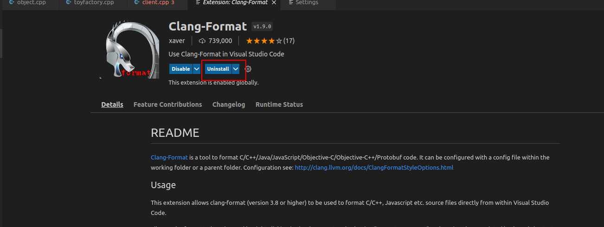
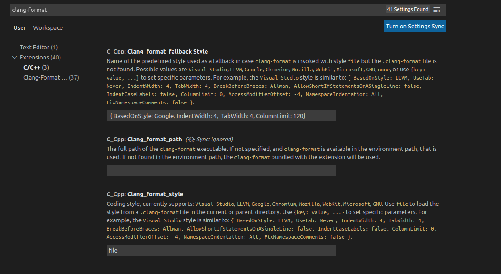

# Setting up clang-formatter in VSC for [Google C++ Style](https://google.github.io/styleguide/cppguide.html)

1. Install clang-format package on Ubuntu 20.04:

`sudo apt update && sudo apt install -y clang-format`

2. Install clang-format extension on VS Code
1. Extensions:
2. Search `clang-format`
3. `install` the extension

4. Preferences -> Settings and search as clang-format
5. Click on `Text Editor` and set the `Default Formatter` as `Clang-Format`
6. Then click on Extensions -> C/C++ on the left menu and you'd see the interface below.

- Clang_format_style: on `file` which means the `.clang-format` file (if exists)
- Clang_format_path: defines the location of the binary. You can find its location by `whereis clang-format` on the terminal.
- Clang_format_fallback Style: if the `.clang-format` file doesn't exist, then it will fallback to this definition. My fallback is ` { BasedOnStyle: Google, IndentWidth: 4,  TabWidth: 4, ColumnLimit: 120}`
7. Search as `formatter` then enable `Format on Save` feature
8. You can generate the `.clang-format` file by 

`clang-format -style="{BasedOnStyle: Google, IndentWidth: 4,  TabWidth: 4, ColumnLimit: 120}" -dump-config > .clang_format`